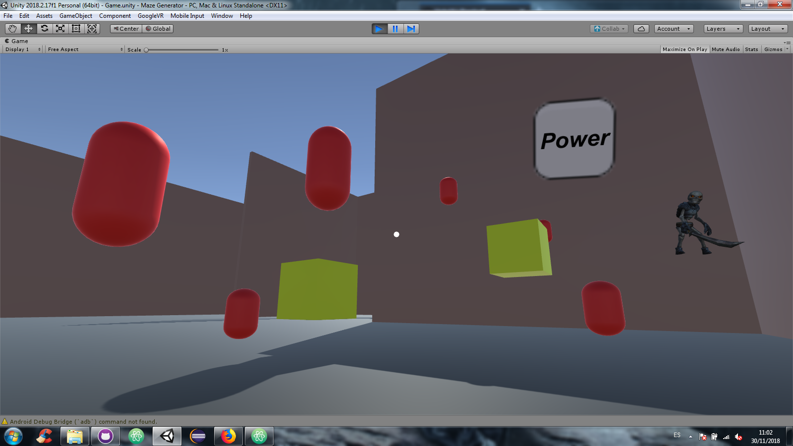

# **Practica 6: Introducción a la realidad virtual en Unity con Google VR (CardBoard)**
* **Autores:**
  - Abel Delgado Falcón: alu0100792218@ull.edu.es
  - Norberto García Gaspar: alu0100611519@ull.edu.es
  - Daniel Darias Sánchez: alu0100783230@ull.edu.es

* **Descripción:**
  * Partiendo de la escena del grupo, crear una aplicación de RV en la que el jugador pueda recoger un poder de la UI que le permita eliminar alguno de los tipos de objetos en la escena (los llamaremos tipo A). El usuario también podrá hacer que vibren todos los objetos de un segundo tipo (los llamaremos B) cuando seleccione con la mirada un objeto  de tipo C.
  
* **Scripts:**
  - **GameController**: Controlador del juego con los eventos, este script contiene codigo del proyecto final que no es necesario para esta práctica.
  - **Death**: controla que el objeto muera al disparase el evento de PointEnter si el player tiene poder.
  - **ObjectShake**: controla la vibración de un objeto si se dispara el evento
  - **PlayerPower**: añade una variable booleana al jugador para determinar si tiene poder o no.
  - **PowerControl**: controla si se interactua con el botón de la UI en VR y cambia el estado booleano del poder del jugador.
  - **ViewDetector**: controla si se esta mirando al objeto y en tal caso, dispara el evento de vibración.
  
  * Debido a que la aplicación se implementa en android y en la versión de ordenador Google VR no funciona como se espera, no se han realizado gifs, pero se ha puesto una captura a modo de recordatorio.
    - Los objetos A (objetos que muere / desaparecen) son los esqueletos, estos tienen una animación de movimiento y de muerte.
    - Los objetos B (cápsulas rojas) vibran cuando se dispara el evento.
    - Los objetos C (cuadrados amarillos) disparan el evento de vibración cuando se les mira en RV. 

